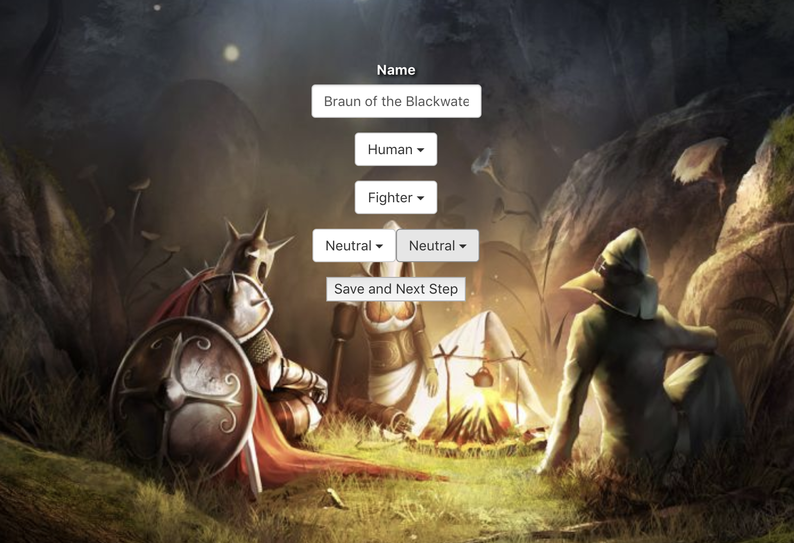
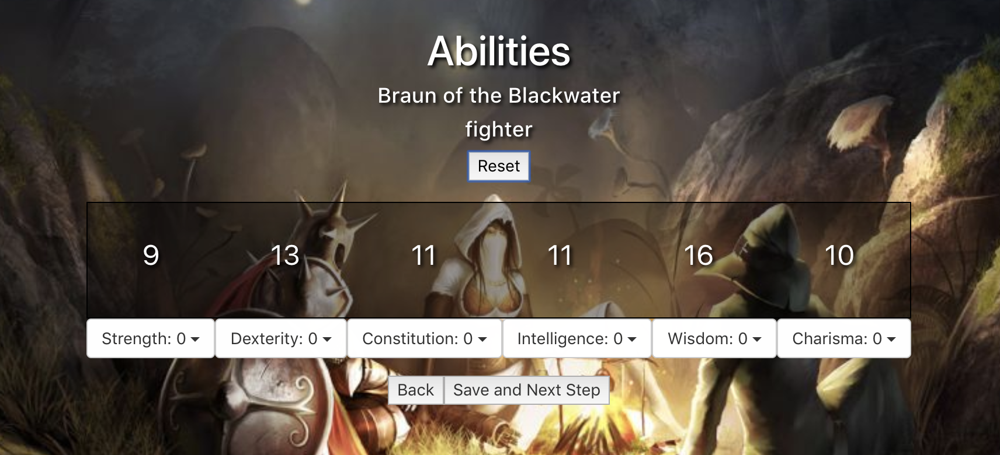
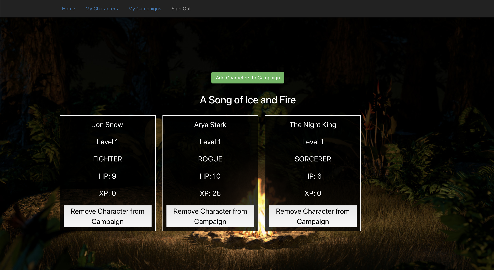
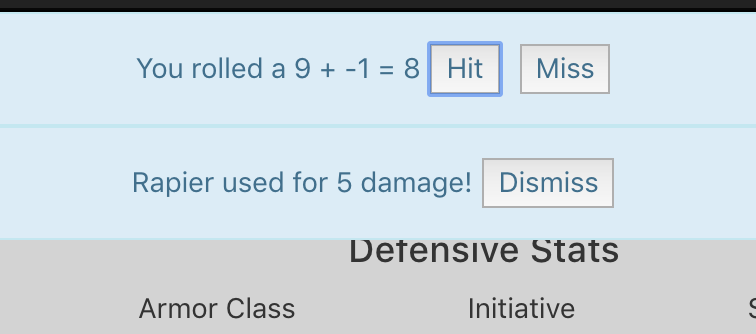
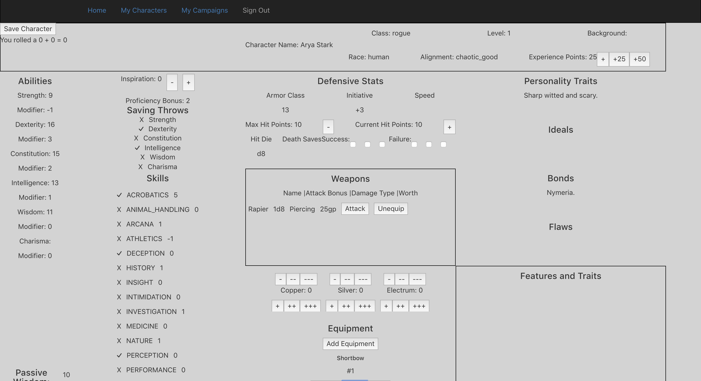

# Table Top Companion

https://tabletopcompanion.herokuapp.com/


For too long, the pen and paper aspect of pen and paper games has been a hinderance and a burden.
It's 2019, let's finally use computers for something useful.

The Table Top Companion will automate and ameliorate the annoying parts of playing table top games
like Dungeons and Dragons. Use your laptop, tablet or phone to keep track of your character, game and rules
instead of relying on heavy books, tons of paper and Google searches.

# How it works
Sign up for an account with a username and email address. From there, let the TTC guide you through making a
D&D character. No need to look up the rules or have dice handy, it will take care of the business so you can focus on the creative aspect of character creation.






Want to start a game? Create a new campaign and invite your friend's characters into the game. Once they've joined, you'll be able to view their important details from one screen.



When it's time to host a session, bring your tablets and laptops along. Update the character sheet live without all of the rolling and erasing. Roll checks that automatically add the right modifiers, and roll attacks that calculate damage.






# Wireframes
Landing / Register : https://wireframe.cc/N87blU

Log In : https://wireframe.cc/1wgXkT

Landing / Logged In: https://wireframe.cc/ovziBx

In Game : https://wireframe.cc/9dhDs5

# Minimum Viable Product
A user can register for an account, then log in to that account.

She can **create** a character that is stored in and retrieved from a database.

A user can use the app as a character tracker, with automated services for in game calculations and random number generation.

	1. Based on class, race and background, generate the following:
		1. Six core attributes
		2. Attribute modifiers
		3. Armor class, initiative, speed
		4. MaxHP
		5. Saving throws
		6. Starting equipment

He can **edit** a character, which will update the database.

A character can be killed, which **deletes** it from the database.

A user can **view** all his characters.

The app can make AJAX calls to the D&D 3rd Party API, which provides game rules and stats.

A user can quickly view game rules through these AJAX calls.

# Post MVP
Use web sockets to connect users in the same campaign.

A user can create campaigns and invite other users to join it.

The owner of a campaign can view all characters associated with it.

The owner of a campaign can make Non-Playable Characters (simpler versions of characters) to use during a campaign.

Users can attack characters, with automated services to determine hits/misses, damage, speed etc.

The owner of a campaign can exchange equipment for a character's currency (barter system).

A user can supply map images to her campaign, then share them with other users.

Accompanying React Native app for easy tablet / mobile use.

# Technologies
Client

	React
	Redux
	React Router
	Axios
	React Bootstrap
3rd Party API

	http://www.dnd5eapi.co/
Custom API / Server

	Rails
	Bcrypt
	JSON Web Tokens
	Action Cable
	Active Record
	PostgreSQL

# Database Associations


# Data Structures
```JSON
"User": {
	"username": "",
	"email": "",
	"password": "",
},

"Campaign": {
	"user_id": 1,
	"name": "",
	"characters": [1,2,3],
},

"Character":{
	"user_id": 1,
	"campaigns": [1,2,3],
	"npc": false,
	"name": "",
	"race": "",
	"class": "",
	"level": 1,
	"alignment": "",
	"xp": 0,
	"attributes": {
		"strength": 0,
		"dexterity": 0,
		"constitution": 0,
		"intelligence": 0,
		"wisdom": 0,
		"charisma": 0,
	},
	"attribute_mods": {
		"str": 0,
		"dex": 0,
		"con": 0,
		"int": 0,
		"wis": 0,
		"cha": 0,
	},
	"inspiration": 0,
	"proficiencyBonus": 0,
	"armorClass": 0,
	"initiative": 0,
	"speed": 0,
	"maxHP": 0,
	"currentHP": 0,
	"tempHP": 0,
	"hitDice": {
		"type": "",
		"num": 0,
	},
	"attacks": {
		"attack":{
			"name": "",
			"bonus": 0,
			"type": "",
			"damage": {
				"type": "",
				"amount": 0,
			},
		},
	},
	"spells": {
		"spell":{
			"name": "",
			"bonus": 0,
			"type": "",
			"damage": {
				"type": "",
				"amount": 0,
			},
		},
	},
	"spellCaseAbility": "",
	"spellSave": 0,
	"spellAttackBonus": 0,
	"cantrips": {
		"cantrip":{
			"name": "",
			"effect": "",
		}
	},
	"deathSaves": {
		"successes": 0,
		"fails": 0,
	},
	"savingThrows": {
		"str": {
			"active": false,
			"amount": 0,
		},
		"dex": {
			"active": false,
			"amount": 0,
		},
		"con": {
			"active": false,
			"amount": 0,
		},
		"int": {
			"active": false,
			"amount": 0,
		},
		"wis": {
			"active": false,
			"amount": 0,
		},
		"cha": {
			"active": false,
			"amount": 0,
		},
	},
	"skills":{
		"acrobatics": {
			"active": false,
			"mod": 0,
		},
		"animalHandling": {
			"active": false,
			"mod": 0,
		},
		"arcana": {
			"active": false,
			"mod": 0,
		},
		"athletics": {
			"active": false,
			"mod": 0,
		},
		"deception": {
			"active": false,
			"mod": 0,
		},
		"history": {
			"active": false,
			"mod": 0,
		},
		"insight": {
			"active": false,
			"mod": 0,
		},
		"intimidation": {
			"active": false,
			"mod": 0,
		},
		"investigation": {
			"active": false,
			"mod": 0,
		},
		"medicine": {
			"active": false,
			"mod": 0,
		},
		"nature": {
			"active": false,
			"mod": 0,
		},
		"perception": {
			"active": false,
			"mod": 0,
		},
		"performance": {
			"active": false,
			"mod": 0,
		},
		"persuasion": {
			"active": false,
			"mod": 0,
		},
		"religion": {
			"active": false,
			"mod": 0,
		},
		"sleightOfHand": {
			"active": false,
			"mod": 0,
		},
		"stealth": {
			"active": false,
			"mod": 0,
		},
		"survival": {
			"active": false,
			"mod": 0,
		}
	},
	"passivePerception": 0,
	"languages": {
		"language": true
	},
	"equipments":{
		"equipment":{
			"name": "",
			"type": ""
		}
	},
	"currency":{
		"copper": 0,
		"silver": 0,
		"electrum": 0,
		"gold": 0,
		"platinum": 0,
	},
	"traits": "",
	"ideals": "",
	"bonds": "",
	"flaws": "",
	"backstory": "",
	"feats": {
		"feat": {
			"name": "",
			"effect": "",
		}
	},
	"organizations": {
		"organization": "",
	},
	"treasures": {
		"treasure": {
			"name": "",
			"worth": 0,
		}
	}
}

```
